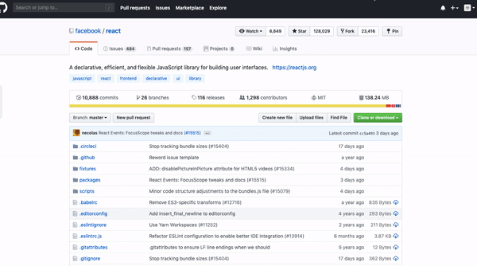

     
    
    

# Pin for GitHub
"Pin for GitHub" allows you to "pin" GitHub repositories to your pin-board. This allows you to save cool repositories without having to publicly star them. Pins use Chrome and Firefox's sync storage to synchronize pins between all your devices.

## Installation
"Pin for GitHub" is availible through the [Firefox Add-On Platform](https://addons.mozilla.org/en-US/firefox/addon/pin-for-github/) and [chrome web store](https://chrome.google.com/webstore/detail/pin-for-github/mafdlgljfdhfefmahhmddeammiejcghk).
You can also install this extension on Firefox by downloading the source from GitHub and loading the unpacked extension through "about:debugging" as a "Temporary Add-On".

## Screenshots

"Pin for GitHub" will add a new "Pin" button to every repository

To view your pinned repositories, simply click the new "Your Pins" link in the dropdown menu or go to <https://github.com/saved>.

## Contributing
Please fork this repository and create a new pull request to contribute to it.

If you notice any errors, please create a new issue on GitHub.

## Attribution
This extension uses the Font Awesome `map-pin` icon, licensed under the Creative Commons license, viewable at <https://fontawesome.com/license>.

## License
Licensed under the [MIT License](LICENSE)